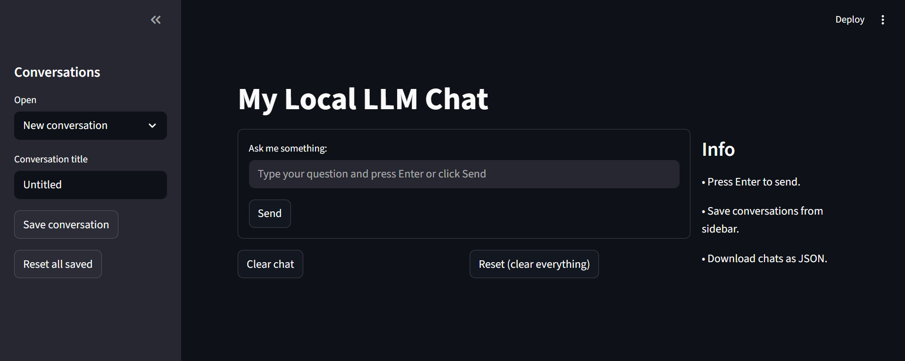

# My Local LLM Chat



A lightweight Streamlit-based chat application that runs language models locally using Ollama. Chat with AI, save conversations, and export your chat history.

## Features

- 💬 **Interactive Chat Interface** - Real-time conversation with a local LLM
- 💾 **Save Conversations** - Store multiple chat sessions with custom titles
- 📥 **Load Previous Chats** - Quickly access saved conversations from the sidebar
- 📥 **Download Chats** - Export conversation history as JSON files
- 🧹 **Easy Management** - Clear individual chats or reset everything with one click
- ⏰ **Timestamps** - Every message is timestamped for easy tracking

## Prerequisites

Before running this application, ensure you have:

- Python 3.8 or higher
- [Ollama](https://ollama.ai) installed and running
- TinyLLaMA model downloaded (`ollama pull tinyllama`)

## Installation

1. Clone or download this repository

2. Install required dependencies:
```bash
pip install streamlit ollama
```

## Usage

1. Start Ollama on your system
2. Run the Streamlit app:
```bash
streamlit run app.py
```

3. Open your browser to `http://localhost:8501`

## How to Use

### Chat
- Type your question in the input field
- Press Enter or click the "Send" button
- Wait for the bot's response

### Save Conversations
1. Enter a title in the "Conversation title" field
2. Click "Save conversation"
3. Your chat is now saved and appears in the dropdown

### Load Saved Conversations
1. Select a conversation from the "Open" dropdown in the sidebar
2. The chat history will be loaded

### Download Chats
- Click "Download current conversation (JSON)" to export your chat as a JSON file

### Clear & Reset
- **Clear chat** - Removes current conversation history
- **Reset (clear everything)** - Removes all chats and saved conversations

## Project Structure

```
llm_streamlit/
├── app.py          # Main Streamlit application
├── image.png       # Application screenshot
└── README.md       # This file
```

## Configuration

The application uses the `tinyllama` model by default. To use a different model:

1. Pull the desired model with Ollama:
```bash
ollama pull <model-name>
```

2. Update line in `app.py`:
```python
response = ollama.chat(
    model="your-model-name",  # Change this
    messages=[{"role": "user", "content": user_input}]
)
```

## Dependencies

- **streamlit** - Web app framework
- **ollama** - Python client for Ollama API

## Session State Management

The app maintains three session states:
- `history` - Current chat messages
- `conversations` - Saved chat sessions
- `current_title` - Title of current conversation

## Notes

- Conversations are stored in memory and will be lost when you close the app (unless you download them)
- The app requires Ollama to be running in the background
- Response time depends on your model and hardware specifications

## Troubleshooting

**"Error: Connection refused"**
- Make sure Ollama is running on your system

**No response from the bot**
- Check that the model is installed: `ollama pull tinyllama`
- Verify Ollama is accessible at localhost:11434

**App crashes on message send**
- Check the terminal for error messages
- Ensure your system has sufficient memory for the model

## License

Feel free to use and modify this application as needed.


